# Qube 개발개요서
| version | date | revision contents | editor |
|:-------:|:----:|-------------------|:------:|
| - | 2026.04.08 | create, init revision | 주명환 |

## Overview
- **프로젝트목표** : 기존 smart-safety를 개선하고, 다양한 거래처의 사항을 적용할 수 있는 시스템 구현
- Architecture, UI, DB, Process는 코딩가이드를 참조하여야 함

## Architecture
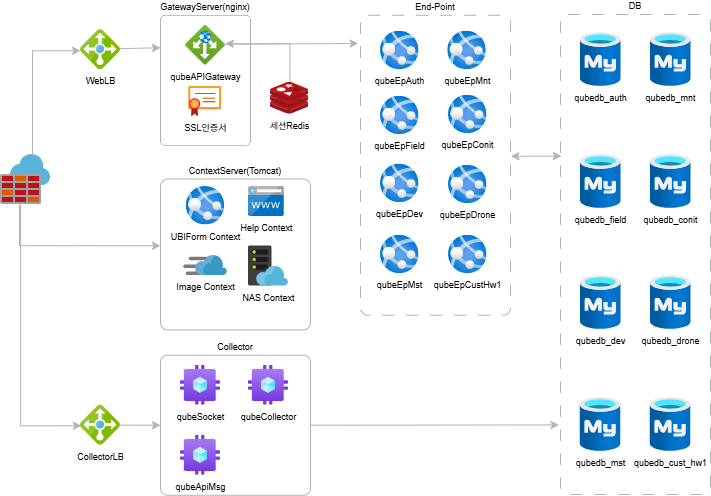
- 모든 프로젝트는 개발계, 운영계의 서버별로 로컬영역의 설정파일을 사용하도록 처리 (db연결정보 등 유출방지용)

### ContextServer
- tomcat 사용
- 그외 UBIForm 및 Image, NAS 등을 context로 추가하여 활용
- 현재 시스템에 대한 Help/Manual문서 서비스 제공예정 (markdown파일형식으로 작성/서비스 예정)

### GatewayServer
- nginx 사용
- MSA의 APIGateway 및 다중 SSL인증서를 처리

### Web시스템
- MSA로 구성
- End-Point는 context처럼 앞쪽에 고정된 namespace
- 시스템구분은 화면url가장 뒤에 .systemname
- systemname에 따라 메뉴구성. 매핑되는 systemname이 없으면 개발용 메뉴로 구성
- 세션은 12시간으로 하되 각 app에서 계정별 지정시간이 지나도록 action이 없으면 로그인으로 이동

| ## | End Point | Role | Remark |
|:--:|-----------|------|--------|
| 1 | qubeMstWeb | 시스템마스터 및 공통사항 | Notice, SystemCode, 첨부파일 등 |
| 2 | qubeAuthWeb | 사용자정보 및 권한 | |
| 3 | qubeFldWeb | 현장정보 및 현장단위 서비스사항 | |
| 4 | qubeDevWeb | 기기정보 및 수집정보, 기기별관제 | 방송, CCTV-AI영상분석, Sensor |
| 5 | qubeMntWeb | 종합현황의 관제 및 클라이언트별 본사대쉬보드 | 지도기반, 조감도기반 중심으로 작성 |
| 6 | qubeDroneWeb | conitDRONE 서비스 | |
| 7 | qubeConitWeb | 대규모작성 Conit Product가 아닌 경우의 conit | |
| 8 | qubeCustWeb | 고객사별 별도시스템중 대규모시스템이 필요없는 경우 | Posco |
| 9 | qubeCust{고객사코드}Web | 고객사별 별도시스템 | 한화:qubeCustHw1Web |

### Collector
- redis없이 app내에서 Queue를 이용하여 구현
- socket기반의 연결끊기, 연결유지 프로세스 및 http기반 수집기 구현

| Collector | Protocol | Role | Remark |
|-----------|:--------:|------|--------|
| qubeSensorCollector | socket | IoT장비 이벤트수집 | 센서와의 연결 끊음 |
| qubeSocketCollector | socket | (상동) | 센서와의 연결을 서버가 끊지 않음 |
| qubeApiCollector | http | IoT장비 이벤트수집 및 외부시스템과의 연계 | |

### Scheduler
- 기본적으로는 web과 분리하여 작성하되, **web(End-Point)과 동일한 영역**을 처리하는 project로 만들기
- 특정 목적으로 web과 분리하여 tasker를 만들 수 있으며 해당 tasker는 아래 표와 같음
- web과 소스는 분리하되 서버는 같이 사용 할 수 있도록 처리
```
- 동작시간 : 첫실행시간 + 텀 * 서버(동작순서)
- 텀 : 원실행텀 * 실행서버수 / 예) 3초단위로 3개서버 = 9초단위
```

| Scheduler | Role | Remark |
|-----------------|------|--------|
| qubeBroadScheduler | 방송 및 SMS, kakaotalk, push | |

## UI

### 관제화면
#### 전체레이아웃
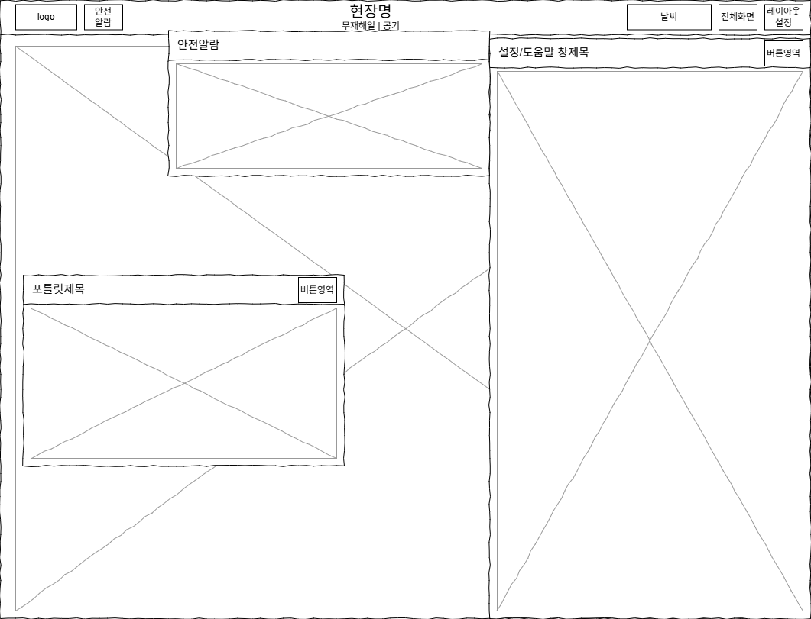
- 안전알람 발생 또는 안전알람아이콘 클릭시 안전알람창이 현장명 밑에 표시되며, 고정하지 않으면 일정시간 후 자동으로 닫기
- 날씨는 오늘날씨를 간략히 표시하고, 클릭시 sidebar를 통해 상세한 날씨정보를 표시
- 전체화면 아이콘클릭시 관제화면 전체를 전체화면에 표시
- 레이아웃설정은 sidebar를 활성화하여 설정할 수 있도록 처리
- 포틀릿은 제목과 버튼영역의 상단영역과 내용부로 구성
- 포틀릿 버튼영역에는 포틀릿에 대한 편집아이콘을 두고, sidebar를 통해 설정을 수정할 수 있도록 함
- 포틀릿은 관제, 대쉬보드에서 공통으로 사용할 수 있도록 구성 (dark-mode, light-mode)
#### 콘텐츠영역 레이아웃 유형
| 레이아웃 | 설명 |
|:-------:|-----|
| 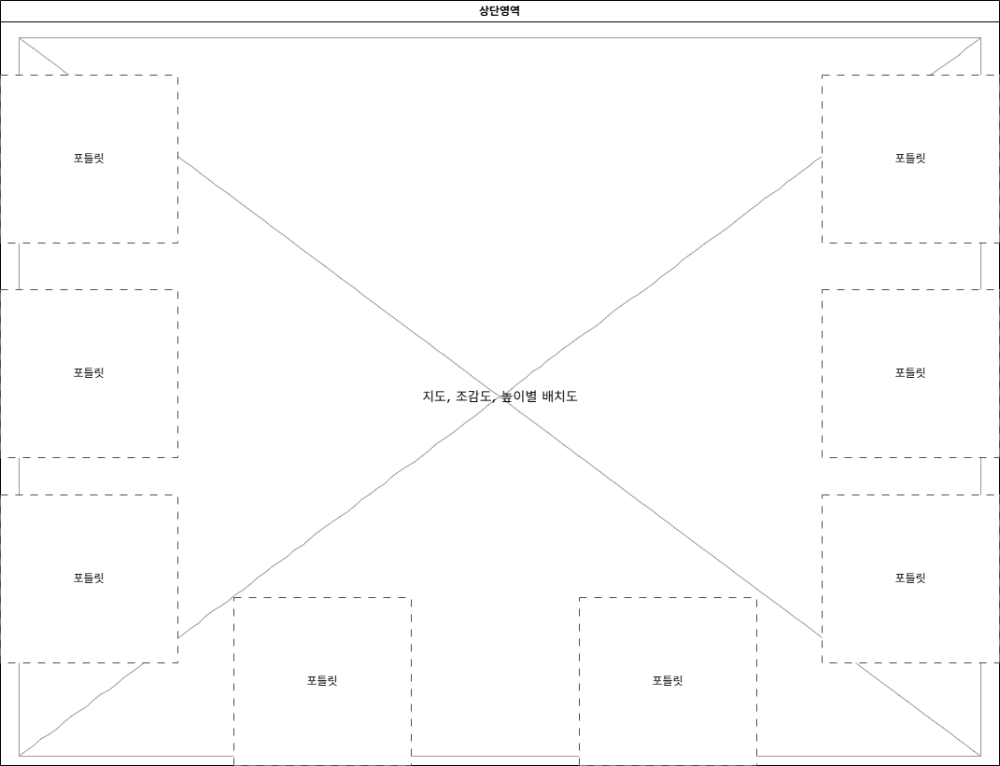 | **포틀릿 Toogle** <br/>화면전체를 채우는 영역과 포틀릿별 숨었다 나왔다 하는 레이아웃 |
| 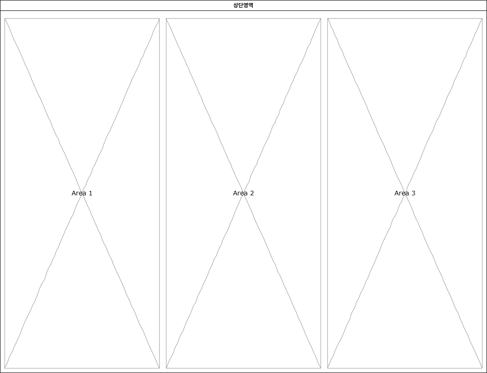 | **균등3분할** <br/>화면영역들을 균등하게 3분할 |
| 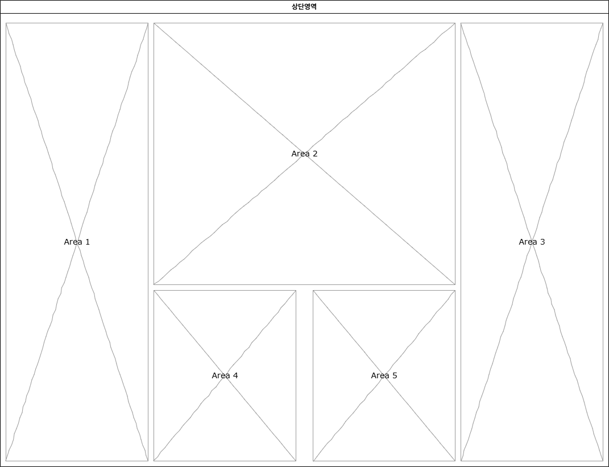 | **중심강조** <br/>가운데 지도, 조감도등을 기준으로 영역이 분포 |
| 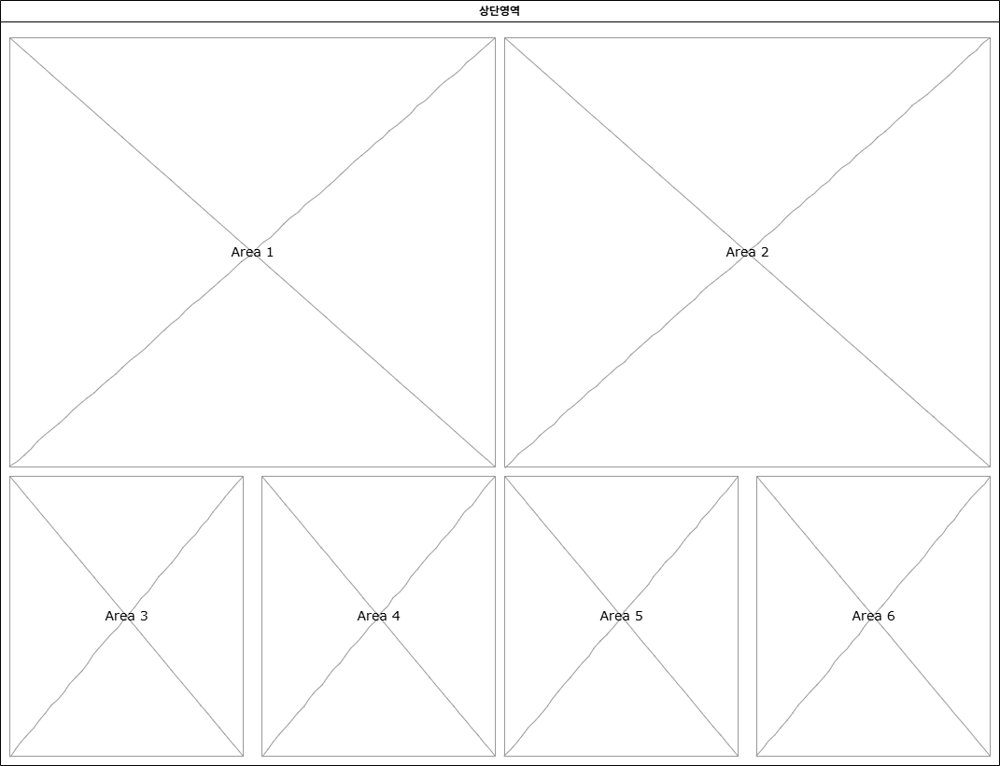 | **큰영역 2개** <br/>지도, 조감도, 층별배치등 큰영역 배치 |
- 관제 body는 dark-mode class 부여

### 메인대쉬보드
- 기본은 균등3분할을 기본으로 하되, 현장별로 사용할 소스파일을 지정할 수 있도록 함(현재와 동일)
- 관제 body는 bright-mode class 부여

### 본사대쉬보드
- 현재 시스템의 기본화면을 서비스하되, 본사별 사용할 소스파일을 지정할 수 있도록 함

### 일반화면
#### 레이아웃
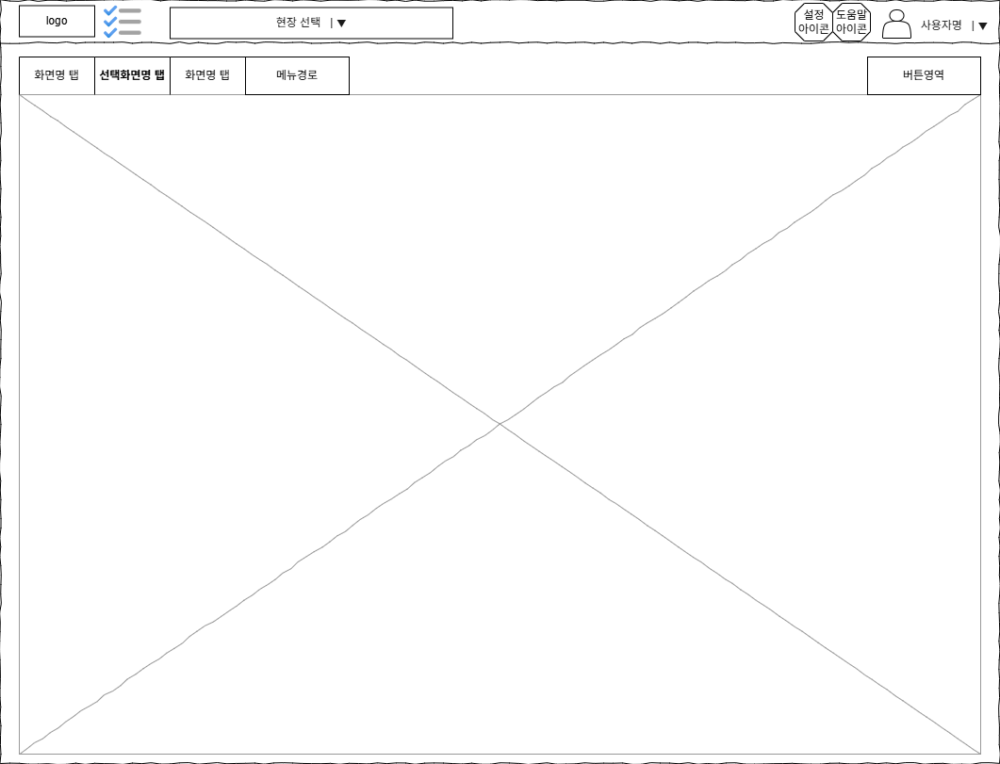
- 화면은 기본적으로 탭구조를 가지게 구성
- 화면명 탭영역 뒤에 홈 부터의 메뉴경로 표시
#### 주메뉴 및 개인용메뉴
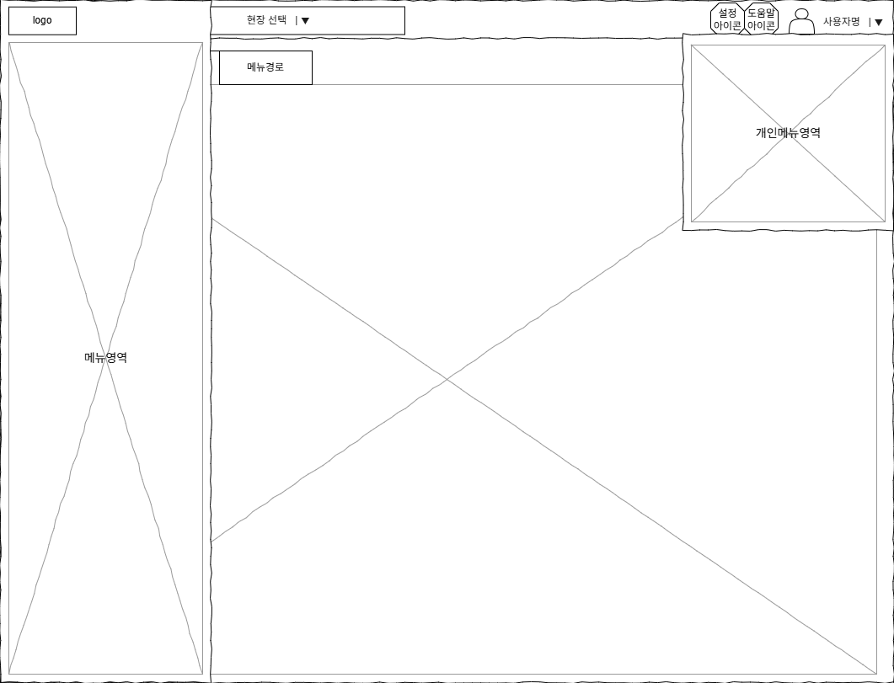
- 주메뉴는 메뉴아이콘을 누르면 나타나고, 메뉴영역외 영역을 클릭하면 닫힘
- 사용자명 영역을 클릭하면 개인용메뉴 표시
#### Sidebar
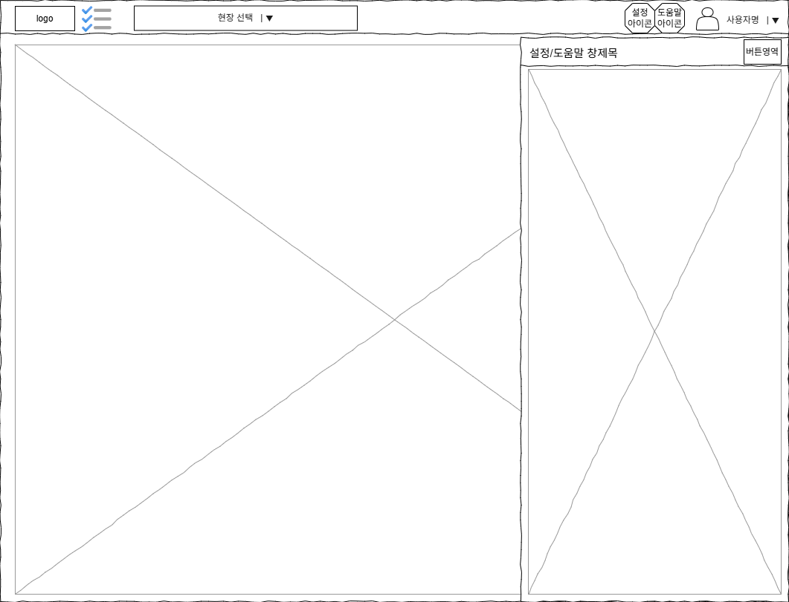
- 설정아이콘, 도움말아이콘 클릭시 해당 화면에 대한 설정 또는 도움말을 sidebar에 표시
- 설정은 해당화면에 대한 옵션, 그리드의 표시항목 등
- **도움말은 md파일**로 작성한 파일을 가져와 보여줌
#### 화면내 권한적용 방법
- 데이타의 저장과 관련된 버튼은 기본적으로 hidden으로 처리
- 사용자의 권한에 맞는 버튼만 class를 부여하여 visible/활성화
- 팝업상세보기의 경우도 조회권한이 있는 사용자만 상세보기를 허용
- 사용이 끝난 현장의 경우 데이타를 변경하는 버튼은 무조건 hidden

## Database

### 사용목적별 DB분리와 민감정보DB 보호방안
1. 민감정보중 민감정보DB로 이동할 항목과 운영DB에 남기고 암호화 할 대상 선정
2. 민감정보DB는 root만 권한이 부여하고 그외 직접 접근 막음
3. root외 계정은 sp, function을 통해서만 민감DB 데이타 처리
#### 계정유형별 허용권한
| 계정유형 | DB접근범위 | 사용자관리 | Table/View | SP, fn | 계정사용자 |
|---------|:---------:|:--------:|:----------:|:------:|:--------:|
| root | 전체DB | 계정 생성/삭제/권한부여 | DML/DDL | 생성, 소스보기, 수정, 삭제, 실행 | DBA 이상 |
| Operator | 전체DB<br/>(민감DB 제외) | 권한없음 | DML/DDL | (상동) | 개발자 |
| Runner | 특정DB | 권한없음 | DML | Only 실행 | program |
#### 현재 취급하는 민감정보 항목과 법률적 처리방법 요약 (최소기준)
| Category | Item | DB Encrypt | View(List) | Remark |
|----------|------|:----------:|------------|--------|
| 개인정보 | 이름 | 양방향 | masking | |
|		| 생년월일 | 양방향 | 나이만 or masking | 나이산출용으로 수집 |
|		| 전화번호 | 양방향 | masking(국번) | |
|		| e-mail | 양방향 | masking | 삭제예정 - DB필드만 있고 사용안함 |
|		| 성별 | 코드화 | | |
|		| 국적 | 코드화 | | |
|		| 차량번호 | 필수아님 | masking | 암호화 강력권고 / 타정보가 있으므로 |
|		| 비상연락망 | 양방향 | masking | |
|		| 사번 | - | - | 최근 추세는 암호화 |
| 생체정보 | 사진파일 | 양방향 | | (*1) |
| 건강정보 | 혈액형 | 양방향 | 권한자만 조회 | |
|		| 고위험군여부 | 양방향 | 권한자만 조회 | |
|		| 고위험 병명 | 양방향 | 권한자만 조회 | (*2) |
|		| 혈압 | 양방향 | 권한자만 조회 | |
|		| 맥박 | 양방향 | 권한자만 조회 | |
|		| 혈당 | 양방향 | 권한자만 조회 | 항목 삭제예정 |
|		| 심전도 | 양방향 | 화면접근자제한 | 도입예정 |
| 위치정보 | GPS좌표 | 양방향 | | 좌표 텍스트표시 주의 |
|		| 비콘 | - | - | 자체는 암호화 대상아님 (*3) |
| 인증정보 | 비밀번호 | 단방향 | | |
- 근로자기준으로 작성되었으나, 사용자 역시 동일한 정보가 있다면 반영하여야 함
- 관리자시스템이므로 list는 masking만으로되 상당부분 지킬 수 있으나, 상세화면의 조회권한 처리가 필요할 수 있음
- (*1) 안면인식용이므로 법적으로는 암호화 필수
	- 연계된 안면인식시스템에서 받은 사진은 암호화 대상
	- URL 노출제한 및 byte로 전송으로도 상당부분 처리되나 법적으로는 암호화 대상
	- 화면을 낮추면 역시 상당부분 처리가 인정되나 기술적 발전사항으로 법적으로는 암호화 대상
- (*2) 특이사항란에 기술중으로 현재는 큰 문제없으나, 문제의 소지는 존재함
- (*3) "개인정보의 안전성 확보조치"기준에 따른 관리필요

### 생성DB와 주요 Table
| DB | name | main Tables | Remark |
|----|------|-------------|--------|
| qube_secure | 개인정보DB | | 개인정보 등 암호화DB |
| qube_mst | 마스터DB | | 시스템전체의 설정 및 모듈화 DB |
| qube_auth | 권한DB | | 개인정보 데이타 제외 |
| qube_field | 현장DB | | |
| qube_dev | 기기DB | | |
| qube_mnt | 관제DB | | 관제설정 및 관제용 데이타 |
| qube_drone | conitDRONE DB | | conitDRONE |
| qube_cust_XXX | 고객사별 DB | | XXX=회사코드 |

## Process

### 1. 계정관리 및 권한
- Session은 서버Side, 세션공유를 위해 Redis를 이용하여 관리
#### 계정/로그인관련 필수 구현기능 및 설정사항
| 기능명 | 설명 |
|-------|------|
| 중복로그인 가능여부 | 중복로그인이 가능한 계정 여부 (기본값:불가) |
| 2차인증 및 사용여부 | 2차인증 기능구현 및 2차인증 사용여부 (기본값:사용) <br/>2차인증방식은 회사마다 달라질 수 있음 (기본: 인증값전송/OTP ???) |
| 관리자에 의한 비밀번호초기화 | random 비번생성 및 계정사용자에게 문자로 비번전송 |
| 비밀번호 필수변경 및 사용여부 | 첫 로그인, 비번초기화, 일정기간 경과시 필수변경 기능구현 및 사용여부 (기본값:사용) |
| 로컬 세션 종료체크 | 로컬에서 세션타임 동안 화면에 동작(API호출기준)이 없을 경우 세션종료 처리 <br/>데이타갱신 및 주기적 호출API 활용을 위해 로컬에서 체크 <br/>관제/대쉬보드 등 일부 화면에서는 세션유지하는 API호출로 데이타 갱신 |
| 로그인 3회 실패 | 5분동안 로그인불가(현재동일) 이후 2차인증 <br/>3회 실패시 실패 이력저장 및 실패 2차인증 이력저장 |
| 로그인 없는 계정의 자동처리 | 6개월이상 로그인불가, 1년이상 계정삭제 처리 <br/>로그인불가 처리시 개인정보 삭제<br/>로그인불가 계정은 이전 비번으로 로그인 후 2차인증, 삭제된 개인정보 입력, 비번 필수변경 <br/>로그인불가 및 삭제 이력저장 |
#### 시스템등급 권한
- 기존에 시스템등급과 권한이 분리되어 있던 것을 시스템등급으로 통합
- 회사별로 메뉴에 대한 각 시스템등급별 권한을 설정
- 이외 개인별 권한부여 및 현장관리자 등록사항에 따라 처리

| Grade | Scope | Desc. |
|:-----:|:-----:|-------|
| 일반권한 | 현장권한 | 가장 기초적인 화면만 이용하는 권한, 모니터링요원 및 감리용 |
| 협력사권한 | 현장권한 | 현장협력사 관리자의 권한 |
| 현장관리자 | 현장권한 | |
| 본사관리자 | 회사권한 | |
| 시스템관리 | 시스템권한 | 시스템협업 협력사 권한 - 특정회사별로 부여, ex:포스코DX, YCN |
| 시스템운영 | 시스템권한 | IT1 직원 권한 - 전체 현장에 적용 |
| 개발자권한 | 시스템권한 | IT1 직원중 시스템개발자 |

### 2. RestAPI 인증/인가
- 사용자와 API인증/인가를 통합하여 설계
- 로그인없이 RestAPI로 통신시 다음의 인증/인가를 기본으로 함

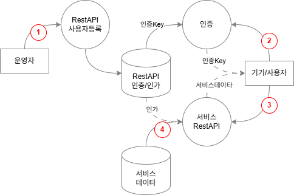

| ## | Desc. |
|----|-------|
| 1. 사용자 등록 | "접근Key", "허용시간" 등 인증/인가를 위한 내용까지 설정 |
| 2. 인증시도 | 기기에서 "접근Key"를 이용하여 "인증Key" 취득 |
| 3. 서비스요청 | Header에 "인증Key"를 넣어 전송<br/> **HEADER : “Authorization:{인증Key}”** |
| 4. 인증확인/서비스 | 인증Key와 허용시간등을 비교하여 인증된 사용자인 경우 데이타를 전송 |

### 3. 서비스설정 최소 관리항목
| element | Name | Desc. |
|:-------:|------|-------|
| Service ID | 서비스ID | 서비스의 ID, 3~4자로 구성 |
| Name | 서비스명 | 서비스를 알아보기 위한 명칭 |
| type | 서비스구분 | 센서/장비/서비스로 구분 |
| Desc. | 설명 | **전체 이용자에게 공개**되는 서비스에 대한 설명 |
| Help | 도움말 | **운영, 설치, 설정**시에 도움이 될 간략한 도움말 |
| Remark | 비고 | |

- 모든 기기와 서비스는 서비스설정을 통해 기능을 관리하여야 함
- 서비스ID로 등록된 용어는 용어사전 보다 우선순위 높게 적용

## 단계별 개발방안

### 0. 관제화면 개발
- 현재 시스템 기준으로 기능개발
- 추후 qube project 정식구현시를 고려하여 개발
### 1. 공통모듈 개발
- codehelper, toolhelper 등 화면처리용 공통모듈 개발
- SMS/katok/push, 방송 등 공통처리 Handler개발
- 암호화DB에 대한 stored procedure, function 개발
### 2. APIGateway 개발
- APIGateway 개발
- 서비스용 서버구성
### 3. 마스터데이타 개발
- qubeMst process에 연결된 기능개발
### 4. 관제화면 개발
- qubeMnt process에 연결된 기능개발

## Note

## Reference

### Architecture 개발메모
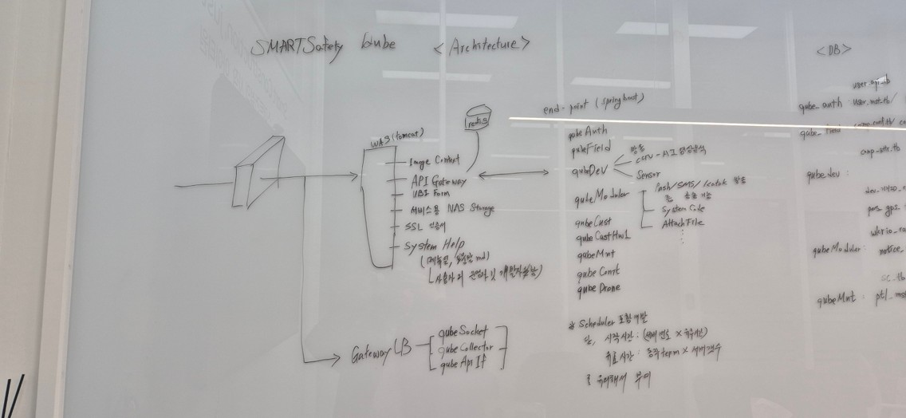

### UI 개발메모
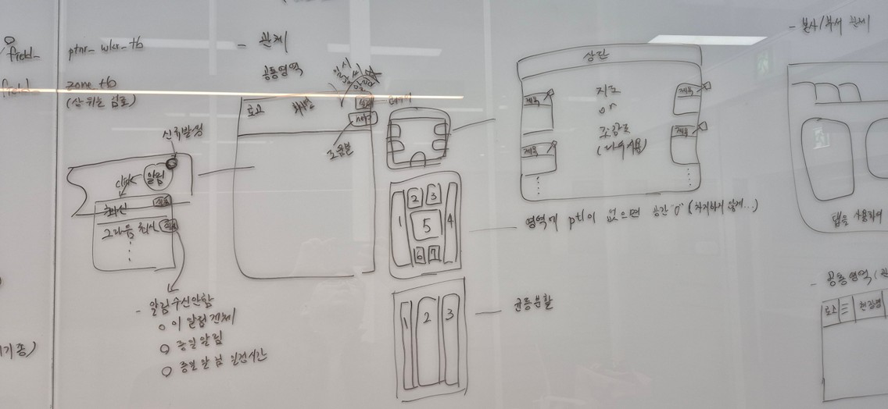
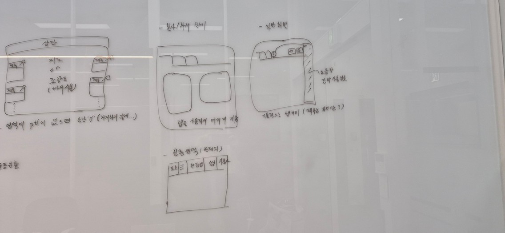

### Database 개발메모
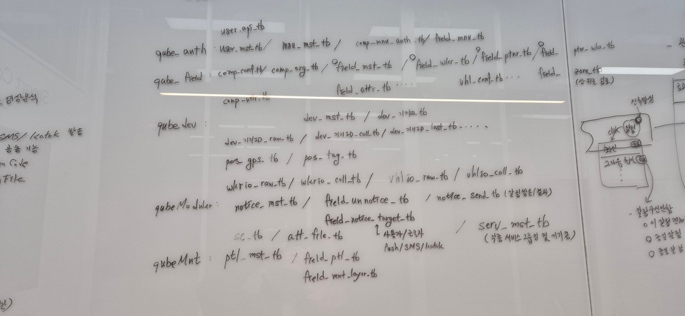
- 하나의 db에 넣지 말고 여러db로 나누어 구성
	- db별 사용 계정 생성
	- 타db 사용시 view로 구성
- db구성은 여러가지로 고려할 필요있음
	- auth, field, dev중 기기설정부분, module, mnt까지는 통합하는 것도 고려대상
- 모든 서비스를 현재 기기종처럼 등록관리

> Copyright 2021. IT1 Platform Businees Team all right reserved.
